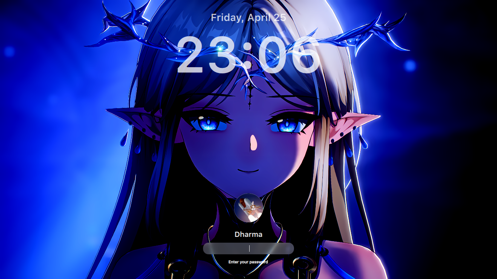

# Cartethiya SDDM Theme

A modern and elegant login theme for SDDM (Simple Desktop Display Manager).



## Features

- Clean and modern design
- Elegant clock display
- User selection with avatar support
- Session type selection
- Smooth animations and transitions
- High DPI support

## Requirements

- SDDM
- Qt 6
- QtQuick 2.15 or higher
- QtGraphicalEffects

## Installation

### Manual Installation

1. Clone this repository:
```bash
git clone https://github.com/ddh4r4m/Cartethiya.git
```

2. Run the installation script as root:
```bash
cd Cartethiya
sudo ./install.sh
```

### Configuration

1. Create or edit `/etc/sddm.conf`:
```bash
sudo nano /etc/sddm.conf
```

2. Add or modify these lines:
```ini
[Theme]
Current=Cartethiya
```

3. Restart SDDM:
```bash
sudo systemctl restart sddm
```

## Testing

To test the theme without installing:
```bash
sddm-greeter --test-mode --theme .
```

## Customization

The theme can be customized by editing the following files:
- `theme.conf` - Basic theme configuration
- `Main.qml` - Main theme layout and functionality
- `components/Clock.qml` - Clock display customization

## License

This theme is licensed under GPL-3.0.

## Credits

- Author: ddh4r4m
- Copyright: (c) 2024, ddh4r4m

## Contributing

Feel free to submit issues and pull requests to help improve this theme. 